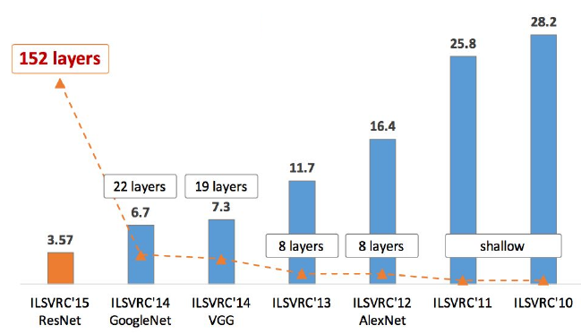

### Linear Classifier
**For SVM gradient**   
-  
-  
-  
-    

**For softmax gradient**
-    
-  , **where**   
-    


### Neural Network  
#### 1. Static Parts
**Universal function approximators**
  

#### 1.1 Activation function

**Sigmoid**
\[\sigma (x) = \frac{1}{1+e^{-x}}\]
\[\frac{d\sigma (x)}{dx} = (1-\sigma (x))\sigma (x)\]  

**Tanh**
\[tanh(x) = 2\sigma(2x)-1\]


**ReLU**  
Most common choice
\[ReLU(x) = \left\{\begin{matrix} x &x\geq 0 \\0,&x <0 \end{matrix}\right.\]  

**PReLU**  
Improved version of ReLU
\[PReLU(x)= \left\{\begin{matrix} x_i ,&x_i\geq 0 \\ \alpha_i x_i,&x_i <0 \end{matrix}\right.\]

**Maxout**  
Improved version of ReLU
\[Maxout(x)= max(w_1^T + b_1, w_2^T + b_2)\]  
It turns out to be ReLU, when   
\[w_1 = b_1 = 0 \]  


#### 1.2 Setting number of layers and their sizes
- For **neural network**, 3 layer outperform 2 layer, but when going even deeper **rarely helps** much more.

- For **convolutional network**, depth found to be an **extremely important** component for a good recognition system.  

- **Larger Neural Networks**(more neurons) can represent more complicated functions --> may cause **overfitting**(can be solved by other controls, like L2 regularization(**larger regularization strength, better overfitting control**), dropout, input noise)**contain more local minimal. less variance, many solutions equally good**  

- **smaller Neural Networks**(less neurons) **contain less local minimal, large variance, rely on luck**

**Conclusion**  
- **Larger networks** will always work **better than smaller networks**, but their higher model capacity must be appropriately addressed with stronger **regularization** (such as higher weight decay), or they might overfit.  

#### 1.3 Data preprocessing
Assume that X is of size [N x D] (N is the number of data, D is their dimensionality)  
**Mean substraction**  
- `` X -= np.mean(X, axis = 0), where every dimension(feature) should center ``  

**Normalizaiton**  
- `` X /= np.std(X, axis =0), not necessary to make each dimension in [-1,1]``  
- It only makes sense to apply this preprocessing if different input features have different scales (or units), but they should be of approximately equal importance to the learning algorithm.

**PCA and whitening**  
- PCA
```  
# Assume input data matrix X of size [N x D]
X -= np.mean(X, axis = 0) # zero-center the data (important)
cov = np.dot(X.T, X) / X.shape[0] # get the data covariance matrix
```  
The covariance matrix is symmetric and positive semi-definite：   
``U,S,V = np.linalg.svd(cov)``   
U are the eigenvectors and S is a 1-D array of the singular values. To decorrelate the data, we project the original (but zero-centered) data into the eigenbasis：  
``Xrot = np.dot(X, U) # decorrelate the data``  
Columns of U are a set of orthonormal vectors (norm of 1, and orthogonal to each other), so they can be regarded as basis vectors. Because SVD returns the U with columns sorted by eigenvalues. PCA can be applied.  
``Xrot_reduced = np.dot(X, U[:,:100]) # Xrot_reduced becomes [N x 100]``

- Whitening  

whitening operation takes the data in the eigenbasis and divides every dimension by the eigenvalue to normalize the scale  
```
# whiten the data: exaggerate the higher frequencies(noise)
# divide by the eigenvalues (which are square roots of the singular values)
Xwhite = Xrot / np.sqrt(S + 1e-5)
```
**Conclusion**  
- PCA/whitening not used for convolutional network. Zero-center the data is often used.
- Preprocessing must be computed on the training data, then apply to validation/test data.  

#### 1.4 Weight and base initialization  
**weight initialization**
- **All zero initialization**  : Not a good choice
- **Small random numbers**  : ``W = 0.01* np.random.randn(D,H)`` randn samples from a zero mean, unit standard deviation gaussian. Not true that small numbers are better. If the weights are small, then gradients will be small which will diminish the gradient signal.  
- **Calibrating the variances with 1/sqrt(n/2)**  : ``w = np.random.randn(n) / sqrt(n/2)``, n is the number of inputs, which ensures that the network initially have approximately the same output distribution and empirically improves the rate of convergence. **Recommended**  
- **Sparse initialization** :  Neurons connected in the same layer?   

**Batch normalization**  : insert the BatchNorm layer immediately after fully connected layers (or convolutional layers), and before non-linearities.  **significantly more robust to bad initialization,act as a form of regularization**   


**Bases initialization**  :
More common, all zero. Small constant value(0.1) also used to fire in the beginning.  

#### 1.5 Regularization to prevent overfitting
**L2 regularization**  : most common  
 Add the term below to the objective.  
 \[0.5\lambda w^2\]
 It means that every weight is decayed linearly: ``W += -lambda * W `` towards zero.  
**L1 regularization**  : relatively common  
Add the term below to the objective.  
\[\lambda |w|\]  
 It leads the weight vectors to become sparse during optimization (i.e. very close to exactly zero), invariant to noise.    
**Max norm constraints**  
Enforce an absolute upper bound on the magnitude of the weight vector for every neuron and use projected gradient descent to enforce the constraint. Typical values of c are on orders of 3 or 4
\[
  \left \|  \underset{w }{\rightarrow} \right \|_2 < c
 \]  
**Dropout**   
While training, dropout is implemented by only keeping a neuron active with some probability p (a hyperparameter), or setting it to zero otherwise.  


**Bias regularization**  
Not common and will not lead to significant worse performance  
**Pre-layer regularization**  
Not common to regularize different layers to different amounts.  
**Conclusion**   
Most common to use a **single, global L2 regularization** strength that is cross-validated. It is also common to combine this with **dropout** applied after all layers. **p=0.5** is a reasonable default, but this can be tuned on validation data. Other methods including **batch normalization**， data augmentation，dropconnect，fractional max pooling. The idea is to **add some kind of randomness** during the training, **marginalize over the noise** during the testing.

####1.6 Loss function  
\[
L = \frac{1}{N}\sum_i L_i
\]
Let's abrreviate f to be the activations of the output layer in a neural network
\[ f=f(x_i ; W)
\]
**Classification**  
Assume a dataset of examples and a single correct label (out of a fixed set) for each example.  
- **SVM**  
\[ L_i = \sum_{j\neq y_i} max(0,f_j-f_{y_i})+1 \]
- **softmax**  
\[ L_i = -log(\frac{e^{f_{y_i}}}{\sum_j e^{f_j}})  \]
For large set of labels, Hierarchical Softmax  recommended

**Attribute Classification**   
Need to build a binary classifier for every single attribute independently  
\[ L_i = \sum_j max(0, 1- y_{ij}f_j)\]
\[L_i = \sum_j y_{ij}log(\sigma(f_j))+(1-y_{ij})log(1-\sigma(f_j))\]
\[\partial L_i/ \partial f_i = y_{ij}-\sigma(f_j)\]
**Regression**   
Predict real-valued quantities.  
- **L2 norm squared**
\[ L_i = ||f-y_i||_2{^2} \]  
- **L1 norm**
\[ L_i = ||f-y_i||_1 = \sum_j|f_j-(y_i)_j|\]
\[\partial L_i/ \partial f_i =\delta_{ij} \quad or  \quad sign（\delta_{ij}）\]

L2 norm（regression） is much harder to optimize than softmax（classification）. L2 is more fragile and applying dropout in the network (especially in the layer right before the L2 loss) is not a great idea

**Conclusion**  
When faced with a regression task, first consider if it is absolutely necessary. Instead, have a strong preference to discretizing your outputs to bins and perform classification over them whenever possible.

#### 2 Dynamic parts
#### 2.1 Gradient checks  
Derive analytic gradient and check with numerical gradient.
**Centered formula**  
\[ \frac{df(x)}{dx}=\frac{f(x+h)-f(x-h)}{2h},\quad h = 10^{-5} \]  
**Relative error for comparison**  
numerical gradient $f_n'$ and analytic gradient  $f_a'$  
\[ \frac{|f_a' - f_n'|}{max(|f_a'|,|f_n'|)} \]   
- [1e-2,] -->wrong
- [1e-4,1e-2]  --> large
- [,1e-4] --> okay for objectives with kinks (not applicable for tanh, sofmax)
- [, 1e-7] --> happy  

Deeper the network, higher the relative loss. 1e-2 for 10 layers should be okay.      
**suggestions**:   
- use double precision  
- be careful of the gradients, if it is too small better bring it to the order of 1.0(scale it temporarily)
- kinks(non-differentiable parts of the objective function) can be easy tracked as the winner of max(x,y) changed. Numerical gradient cross a kink will bot be exact.  
- use few datapoints for faster checking and less kink problems.
- step size of h should not be too small. 1e-4 or 1e-6 should be fine.
- gradcheck during a “characteristic” mode of operation
- don’t let the regularization loss overwhelm the data loss. Turn off regularization and check the data loss alone first, and then the regularization term second and independently.  
- Remember to turn off dropout/augmentations.
- Check only few dimensions for every separate parameter.

#### 2.2 Sanity check  
**Look for correct loss at chance performance**  check data loss alone, check initial loss.  
**Overfit a tiny subset of data**

#### 2.3 Learning process

#### observation during the learning process
- **loss function**  : loss over epoch(time)   
- **train/val accuracy** : accuracy over epoch, the amount of overfitting in your model, model capacity  
- **ratio of weights** : the update magnitudes to the value magnitudes should around 1e-3  
- **activation/gradient distributions per layer**:  plot activation/gradient histograms for all layers of the network  
- **First-layer visualization**  

#### Parameter updates  
**vanilla update:**    
``x+= -learning_rate * dx``  
**momentum update:**   
better converge rates on deep networks (has accelaration)  
v initialized at 0. mu(momentum), with a typical value of 0.9, actually the meaning is damping coefficient. When do cross validation, the values can be [0.5, 0.9, 0.95, 0.99].  A typical setting is to start with momentum of about 0.5 and anneal it to 0.99 or so over multiple epochs for annealing.
```
# Momentum update
v = mu * v - learning_rate * dx # integrate velocity
x += v # integrate position
```

**Nesterov Momentum**   (**worth trying**)   
Evaluate the gradient at different point.
```
x_ahead = x + mu * v
# evaluate dx_ahead (the gradient at x_ahead instead of at x)
v = mu * v - learning_rate * dx_ahead
x += v
```
Another version:
```
v_prev = v # back this up
v = mu * v - learning_rate * dx # velocity update stays the same
x += -mu * v_prev + (1 + mu) * v # position update changes form
```
**Annealing the learning rate:**  
learning rate decay:
- Step decay: Reduce the learning rate by some factor every few epochs.  **Prefered**
- Exponential decay: $\alpha = \alpha_0 /(1+kt )$
- 1/t decay: $\alpha = \alpha_0/(1+kt)$

**Second order methods:** $\quad$  (gradient -->first order)   
Newton's method:  $\quad$(large computation--> momentomn methods are more common)  
$x \leftarrow x - [Hf(x)]^{-1}/ \nabla f(x)$ where $Hf(x)$ is the Hessian matrix, which is a square matrix of second-order partial derivatives of the function. Inverse Hessian leads the optimization to take **more aggressive** steps in directions of **shallow curvature** and **shorter steps** in directions of **steep curvature**.  

**Per-parameter adaptive learning rate methods:**   
- Adagrad (eps = [1e-8,1e-4] )
```
# Assume the gradient dx and parameter vector x
cache += dx**2
x += - learning_rate * dx / (np.sqrt(cache) + eps)
```  
- RMSprop   (decay_rate = [0.9,0.99,0.999])
```
cache = decay_rate * cache + (1 - decay_rate) * dx**2
x += - learning_rate * dx / (np.sqrt(cache) + eps)    
```
- Adam  (eps = 1e-8, beta1 = 0.9, beta2 = 0.999)   **Recommended, default**
```
m = beta1*m + (1-beta1)*dx
v = beta2*v + (1-beta2)*(dx**2)
x += - learning_rate * m / (np.sqrt(v) + eps)
```
```
# add the bias correction, compensates for the fact that in the first few time steps the vectors m,v are both initialized and therefore biased at zero, before they fully “warm up”
# t is your iteration counter going from 1 to infinity
m = beta1*m + (1-beta1)*dx
mt = m / (1-beta1**t)
v = beta2*v + (1-beta2)*(dx**2)
vt = v / (1-beta2**t)
x += - learning_rate * mt / (np.sqrt(vt) + eps)
```
**Conclusion**  


#### Hyperparameter optimization  
- the initial learning rate
- learning rate decay schedule (such as the decay constant)
- regularization strength (L2 penalty, dropout strength)  

**Tricks**
- Implementation  
 master(launch or kill workers) and worker(sample random hyperparameters and perform the optimization)   
- Prefer one validation fold to cross-validation
- Hyperparameter ranges : search for hyperparameters on log scale  
like ``learning_rate = 10 ** uniform(-6, 1)`` The same strategy should be used for the regularization strength.Some parameters (e.g. dropout) are instead usually searched in the original scale (e.g. ``dropout = uniform(0,1)``).  
- Prefer random search to grid search
- Careful with best values on border： double check that the final learning rate is not at the edge of this interval  
- State search from coarse to fine
- Bayesian Hyperparameter Optimization

#### 2.4 Evaluation
**Model Ensembles**
Train multiple independent models and at test time average their predictions
- Same model, different initializations.  
cross-validation to determine the best hyperparameters and give different random initializations  
- Top models discovered during cross-validation.  
cross-validation to determine several best models.
- Different checkpoints of a single model.   
 taking different checkpoints of a single network over time
- Running average of parameters during training.   
maintain a second copy of the network’s weights in memory that maintains an exponentially decaying sum of previous weights during training to average the state of the network over last several iterations

#### 2.5 Summary
- For activation functions, **ReLU** is the most common choice
- **Fully-Connected layers** : neurons in adjacent layers have full pair-wise connections, but neurons within a layer are not connected.
- layered architecture enables very efficient evaluation of Neural Networks based on matrix multiplications interwoven with the application of the activation function.
- Neural Networks are universal function approximators
- **larger networks** will always work better than smaller networks, but their higher model capacity must be appropriately addressed with **stronger regularization** (such as higher weight decay), or they might overfit.
- The recommended preprocessing is to **center** the data to have mean of zero, and **normalize** its scale to [-1, 1] along each feature
- Initialize the weights by drawing them from a gaussian distribution with standard deviation of $\sqrt{2/n}$, where nn is the number of inputs to the neuron. E.g. in numpy: ``w = np.random.randn(n) * sqrt(2.0/n)``.
- Use **L2 regularization and dropout (the inverted version)**
- Use **batch normalization**
- different tasks have different loss functions
- Gradient check your implementation with a small batch of data and be aware of the pitfalls.
- As a sanity check, make sure your initial loss is reasonable, and that you can achieve 100% training accuracy on a very small portion of the data
- During training, monitor the loss, the training/validation accuracy, and if you’re feeling fancier, the magnitude of updates in relation to parameter values (it should be ~1e-3), and when dealing with ConvNets, the first-layer weights.
- The two recommended updates to use are either **SGD+Nesterov Momentum or Adam**.
- Decay your learning rate over the period of the training. For example, halve the learning rate after a fixed number of epochs, or whenever the validation accuracy tops off.
- Search for good hyperparameters with **random search** (not grid search). Stage your search from coarse (wide hyperparameter ranges, training only for 1-5 epochs), to fine (narrower rangers, training for many more epochs)
- Form model ensembles for extra performance

#### 2.6 Example for paramter adjusting

- The loss is decreasing more or less linearly, which seems to suggest that the **learning rate** may be too **low**. Moreover, there is no gap between the training and validation accuracy, suggesting that the model we used has **low capacity**, and that we should increase its size. 
### CNN  
#### 1. Structure
ConvNet is a sequence of Convolutional Layers, interspersed with activation functions( one CONV, one RELU)  
**Convolutional layer**, output size: ``(N + pad*2 - F) / stride + 1 `` $\quad$  params:``(F^2 * filter_depth + 1) * filter_num `` (+1 for bias)  


**Pooling layer**, down sampling, Max pooling
- makes the representations smaller and more manageable
- operates over each activation map independently  

  

**Fully-Connected(FC) layer**
- Contains neurons that connect to the entire input volume, as in ordinary Neural Networks

**Summary**  
- ConvNets stack CONV,POOL,FC layers
- Trend towards smaller filters and deeper architectures
- Trend towards getting rid of POOL/FC layers (just CONV)
- Typical architectures look like  
``[(CONV-RELU)*N-POOL?]*M-(FC-RELU)*K,SOFTMAX`` where N is usually up to ~5, M is large, 0 <= K <= 2.
  - but recent advances such as ResNet/GoogLeNet challenge this paradigm
#### 2. Case study


**2.1 AlexNet**

**2.2 ZFNet:improved AlexNet**  
CONV1： from (11×11 stride 4 ) to (7×7 stride 2 )   
CONV3,4,5: instead of 384, 384, 256 filters use 512, 1024, 512  
**2.3 VGG16/19**  
Total Mem：96M/image（forward） $\quad$  Total params:138M params

   

**2.4 GoogLeNet**
Stacked inception modules (computation complexity)  
No FC layers, much less params than AlexNet(12×)


**2.5 ResNet**


**2.6 Dense blocks**  
- Dense blocks where each layer is connected to every other layer in feed forward fashion
 - Alleviates vanishing gradient, strengthens feature propagation, encourages feature reuse
